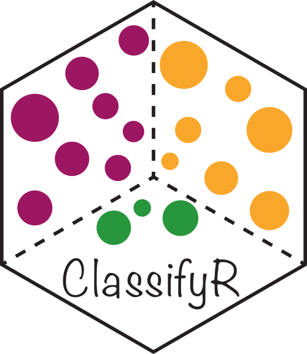

# ClassifyR: Performance evaluation for multi-view data sets and seamless integration with MultiAssayExperiment and Bioconductor



ClassifyR's performance evaluation focuses on model stability and interpretability. Based on repeated cross-validation, it is possible to evaluate feature selection stability and also per-sample prediction accuracy. Also, multiple omics data assays on the same samples are becoming more popular and ClassifyR supports a range of multi-view methods to evaluate which data view is the most predictive and combine data views to evaluate if multiple views provide superior predictive performance to a single data view.

##  Installation 

The recommended method of installing ClassifyR is by using Bioconductor's BiocManager installer:

```
library(BiocManager)
install("ClassifyR", dependencies = TRUE)
```

The above code will install all packages that provide feature selection or model-building functionality. If only one or two methods are desired then the dependencies option could be omitted and those packages providing functionality installed manually. 
 
##  Website

Please visit [the ClassifyR website](https://sydneybiox.github.io/ClassifyR/) to view the main vignette as well as articles that provide more in-depth explanations for various aspects of the package. Details of performance evaluation, multi-view methods and contributing a wrapper for a new algorithm to the package are provided.


## Reference

Strbenac D., Mann, G.J., Ormerod, J.T., and Yang, J. Y. H. (2015) ClassifyR: An R package for performance assessment of classification with applications to transcriptomics, *Bioinformatics*.
